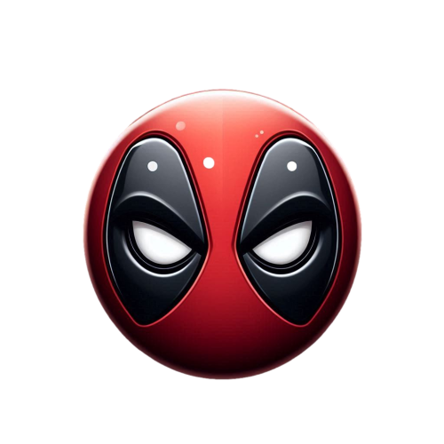

# Triton

A degen agent rebalancing a memecoin fund through Cowswap and Safe. Now in red!

<p align="center">
  
</p>

## MemePool: your automated memecoin fund

Memecoins are everywhere, but with so many options, it’s impossible to know which ones to buy or sell. That’s where MemePool comes in—an autonomous agent that builds and manages a memecoin portfolio for you.

Just connect MemePool to a Safe multisig with USDC, and it will handle the rest.

## How It Works

MemePool scans trending memecoins across Twitter/X, Reddit, CoinGecko, and even factors in the Crypto Fear & Greed Index. It continuously analyzes market sentiment and real-time trends, using Gemini to refine its strategy.

When it’s time to rebalance, MemePool executes trades seamlessly through CowSwap, keeping your portfolio optimized—without you having to sift through endless degen threads.

An easily extensible agent micro-framework written specifically for the Safe Agentathon serves as the rails to connect all these APIs and SDKs together.


## Transparency & Copy-Trading:

Every trade is automatically posted to Twitter/X, so you (and anyone else) can track its moves—or even copy-trade in real-time.

Let MemePool do the work while you enjoy the ride.

## Tech stack

* Python
* Safe multisig
* CowSwap
* Gemini API
* Twitter API
* Reddit API
* Coingecko API
* Crypto Fear & Greed Index API
* APE framework


## Dependecies

* git
* [uv](https://docs.astral.sh/uv/)


## How to run

1. Clone the repo:

    ```bash
    git clone git@github.com:dvilelaf/memepool.git
    cd triton
    ```

2. Prepare the virtual environment:

    ```bash
    uv sync
    ```

3. Copy the env file and fill in the required environment variables.:

    ```bash
    cp sample.env .env
    ```

4. Run.

    ```bash
    uv run run.py
    ```